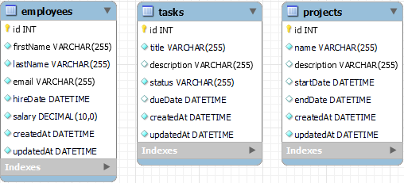

# Assignment: Sequelize Migrations and Model Updates
Learn how to create and run migrations in Sequelize to manage database schema changes over time. Update existing models and handle schema modifications using migrations.

**Estimated Time to Completion:** 120 minutes

**Level of Complexity:** Medium

## Instructions

1. Read through the directions below. Note: you will be provided any necessary files on which to work.
2. Complete the necessary elements as outlined.
3. Zip the project and submit to [XXXXX] by the due date.

## Evaluation Criteria & Learning Objectives

- Create and run Sequelize migrations to manage schema updates.
- Update existing Sequelize models and handle schema changes.
- Validate the changes using MySQL Workbench or a similar tool.

## Directions

You have previously created a database schema with three models: `Employee`, `Project`, and `Task`. For this assignment, you will modify the schema as follows:

1. Review the Provided Wireframe:
    - You will be given a wireframe that outlines the updated schema requirements. Review this to understand the new schema changes.

2. Update the Models:
    - Delete Two Models:
      - From the previous assignment, choose two of the models (`Employee`, `Project`, or `Task`) and remove them from your project.
    - Update the Remaining Model:
      - Update the remaining model to reflect changes required by the new schema (e.g., add new fields, remove existing fields, or modify data types).

    
3. Generate Migrations:
    - Create a migration file to delete the two models from the database.
    - Create another migration file to apply changes to the remaining model based on the updated schema.

4. Run Migrations:
    - Use the Sequelize CLI to run the migrations and apply the changes to the database.

5. Validate the Changes:
    - Use MySQL Workbench or a similar tool to verify that the database schema has been updated correctly. Ensure that the deleted tables are removed and the remaining table reflects the new schema.

    

## MVP Requirements:

- Model Files:
  - Update the Sequelize model files according to the new schema requirements.
- Migration Files:
  - Generate and apply migration files for schema updates.
- Database Schema:
  - Confirm the updated schema in MySQL Workbench or equivalent tool.

## Expected Outputs:

- Updated Models: Reflecting the new schema as per the wireframe.
- Migration Files: Correctly managing schema changes.
- Database Schema: Updated and verified using MySQL Workbench or similar tool.

## Additional Notes:

- Ensure that all migrations are accurately generated and applied without data loss.
- Submit your updated project files, migration scripts, and validation screenshots or exports.

